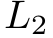
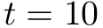

# ode45-cash-karp [](https://travis-ci.org/scijs/ode45-cash-karp) [](http://badge.fury.io/js/ode45-cash-karp) [](https://david-dm.org/scijs/ode45-cash-karp)

> Integrate a system of Ordinary Differential Equations using the Fifth Order Adaptive Cash-Karp method


## Introduction

This module integrates a system of ordinary differential equations of the form

<p align="center"></p>

where  is a vector of length . Given time step , the [Cash-Karp](https://en.wikipedia.org/wiki/Cash%E2%80%93Karp_method) method uses a fifth order Runge-Kutta scheme with a fourth order embedded estimator in order to control the error. In other words, the same intermediate values used in calculating the fifth order update can be used to calculate a fourth order estimate. The difference yields an error estimate, and the error estimate controls the timestep .

## Install

```bash
$ npm install ode45-cash-karp
```

## Example

### [Van der Pol oscillator](https://en.wikipedia.org/wiki/Van_der_Pol_oscillator)

```javascript
var ode45 = require('ode45-cash-karp')

// The derivative function for a Van der Pol oscillator:
var vanderpol = function(dydt, y, t) {
  dydt[0] = y[1]
  dydt[1] = 4 * (1-y[0]*y[0])*y[1] - y[0]
}

// Initialize:
var y0 = [2,0],
    t0 = 0,
    dt0 = 1e-3,
    integrator = ode45( y0, vanderpol, t0, dt0 )

// Integrate up to tmax:
var tmax = 10, t = [], y = []
while( integrator.step( tmax ) ) {
  // Store the solution at this timestep:
  t.push( integrator.t )
  y.push( integrator.y )
}
```

### Common patterns

A single adaptive step:
```
integrator.step()
integrator.y      // current state
integrator.t      // current time
integrator.dt     // newly adapted timestep
```

A single adaptive step, returning false if  reached:
```
integrator.step( 1.5 ) // returns true if t < 1.5
integrator.step( 1.5 ) // returns false if t = 1.5
```

Ten adaptive timesteps in sequence:
```
integrator.steps( 10 )
```

Ten timesteps, halting early and returning false if  is reached::
```
integrator.steps( 10, 1.5 )
```

Take any number of timesteps until :
```
integrator.steps( Infinity, 1.5 )
```

## API

#### `require('ode45-cash-karp')( y0, deriv, t0, dt0 [, options] )`
#### Arguments:
- `y0`: an array or typed array containing initial conditions. This vector is updated in-place with each integrator step.
- `deriv`: a function that calculates the derivative. Format is `function( dydt, y, t )`. Inputs are current state `y` and current time `t`, output is the calculated derivative `dydt`.
- `t0`: initial time .
- `dt0`: initial time step .
- `options`: an optional associative array of options. Valid parameters are:
  - `tol`: The target error level to be acheived. Default is: .
  - `maxIncreaseFactor`: The maximum factor by which to increase the timestep if the error tolerance is met. Default value is 10. This limit is applied at the end of a successful timestep.
  - `maxDecreaseFactor`: The maximum factor by which to decrease the timestep if the error tolerance is not met. Default value is 10. This limit is applied on each trial step until the error tolerance is acheived.
  - `dtMinMag`: The minimum allowed magnitude of . If limit is exceeded during adaptation, a warning is printed to the console and the timestep completes with  clipped to the the prescribed magnitude. If `undefined`, this limit is ignored. Default value is `undefined`.
  - `dtMaxMag`: The maximum allowed magnitude of . This limit is applied at the beginning of each step. If a timestep larger than this magnitude is requested, the timestep is executed with  clipped to the prescribed magnitude. If `undefined`, this limit is ignored. Default value is `undefined`.
  - `errorScaleFunction`: The function used to compute a normalizing factor for the error in a given dimension. See below for details.
  - `errorReduceFunction`: The reduce operation by which errors in each dimension are combined into a single error metric. See below for details.
  - `errorPostFunction`: An operation applied to the total error. For example, if using the  norm this would be a square root. See below for details.

#### Returns:
Initialized integrator object.

#### Properties:
- `n`: dimension of `y0`.
- `y`: current state; a reference to input array `y0`.
- `deriv`: function that calculates the derivative.
- `t`: current time, incremented by `dt` on each time step.
- `dt`: current time step . Initialized from input `dt0`. May be changed, but will be overwritten with each adaptive step in order to acheive the prescribed error bound.
- all options are copied to properties on the integrator object and may be changed at any time.

#### Methods:
- `.step( [tLimit] )`: takes a single step of the integrator and stores the result in-place in the `y` property. Returns true if `tLimit` was not provided or if `t` has not reached the limit, otherwise returns false, meaning `t` has reached `tLimit`.
- `.steps( n, [tLimit] )`: takes `n` steps of the integrator, storing the result in-place in the `y` property. Exits early if `tLimit` is reached. Returns true if `tLimit` was not provided or if `t` has not reached the limit, otherwise returns false, meaning `t` has reached `tLimit`. Note that, for example, `.steps( Infinity, 10 )` is valid and will take whatever number of step is required to reach .

### Error Estimation
Ideally, there would be no choices in error computation since this library would implement the best possible choices, but I've left this configurable.

##### `errorScaleFunction: function( i, dt, y, dydt )`
This function receives the dimension number `i`, the current timestep `dt`, the current state `y`, and the derivative calculated at the beginning of the step, `dydt`. It must return a normalization factor by which the error in the given dimension is normalized. It is executed once at the beginning of each timestep and not for subsequent trial steps. By default, it is:

```
function errorScaleFunction( i, dt, y, dydt ) {
  return Math.abs(y) + Math.abs(dt * dydt) + 1e-32
}
```

##### `errorReduceFunction: function( i, accumulatedError, errorEstimate )`
This function performs a reduce operation on the per-dimension error. `accumulatedError` is initially zero. The function must add the error estimate in dimension `i` and return a new error estimate. By default, the error reduce function simply returns the maximum error:

```
function errorReduceFunction( i, accumulatedError, errorEstimate ) {
  return Math.max( accumulatedError, Math.abs(errorEstimate))
}
```

##### `errorPostFunction: function( accumulatedError, errorEstimate )`
This function applies a mapping to the total reduced error resulting from `errorReduceFunction`. For the  norm, this would just be `Math.sqrt`; for the  norm, this is simply a no-op:

```
function errorPostFunction( accumulatedError ) {
  return accumulatedError
}
```

## Credits

(c) 2015 Ricky Reusser. MIT License